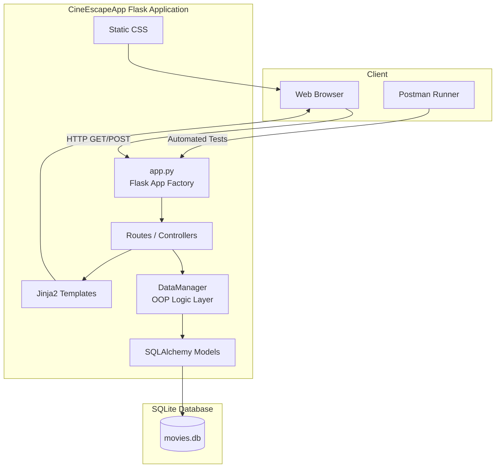

# 🎬 CineEscapeApp  
### A Clean, OOP‑Driven Python Flask Application for Managing Users & Movies

Welcome to **CineEscapeApp**, a fully structured, object‑oriented Flask application designed for clean architecture, deterministic database behavior, automated testing, and Postman‑driven API validation.  
This project demonstrates best practices in Python packaging, Flask app structure, SQLAlchemy ORM, and cross‑platform development.

---

## 🏷️ Badges


---

## 📁 Project Structure
```
codio-oop-movie-flask-sqlalchemy-cineescapeapp-project
├── CHANGELOG.md
├── CineEscapeApp
│   ├── __init__.py
│   ├── app.py
│   ├── config.py
│   ├── data_manager.py
│   ├── instance
│   │   └── movies.db
│   ├── logs
│   │   └── cineescape.log
│   ├── models.py
│   ├── pyproject.toml
│   ├── requirements.txt
│   ├── reset_db.py
│   ├── static
│   │   └── style.css
│   ├── templates
│   │   ├── 400.html
│   │   ├── 404.html
│   │   ├── 500.html
│   │   ├── base.html
│   │   ├── index.html
│   │   ├── macros.html
│   │   └── movies.html
│   └── tests
│       ├── conftest.py
│       ├── test_movies.py
│       └── test_users.py
├── codio.postman_environment.json
├── create_cineescape.sh
├── logs
│   ├── cineescape.log
│   ├── cineescape.log.1
│   ├── cineescape.log.2
│   └── cineescape.log.3
├── macOS.postman_environment.json
├── pytest.ini
└── README.md

8 directories, 31 files
```

---

## 🏗️ Architecture Diagram


---

## ⚡ Quickstart

### 1. Clone the Repository
```bash
git clone <your-repo-url>
cd codio-oop-movie-flask-sqlalchemy-cineescapeapp-project
```

### 2. Create a Virtual Environment
```bash
python3 -m venv .venv
source .venv/bin/activate
```

## Environment Setup
Use the `.venv` at project root (`/workspace/.venv`) for all development.  
Do not create nested virtual environments inside `CineEscapeApp/`.


### 3. Install Dependencies
```bash
pip install -r CineEscapeApp/requirements.txt
```

### 4. Reset the Database
```bash
python3 -m CineEscapeApp.reset_db
```

### 5. Run the Application
```bash
python3 -m CineEscapeApp.app
```

App will be available at:
```
http://127.0.0.1:5001/
```

### 6. Run Tests
```bash
pytest -q
```

### 7. Use Postman Collection
* Import `CineEscapeApp.postman_collection.json`
* Import the correct environment:
   * `codio.postman_environment.json` (Linux)
   * `macOS.postman_environment.json` (macOS)
* Run the full automated suite via Postman Runner

This ensures:
* consistent DB state
* automated CRUD validation
* zero manual testing

---

## 🤝 Contributor Guide

Thank you for considering contributing to CineEscapeApp! This guide ensures consistent, high‑quality contributions.

### 🧱 Project Standards

#### Code Style
* Follow PEP 8
* Use single‑line docstrings for utility functions
* Keep Flask routes thin; business logic belongs in `DataManager`

#### Git Workflow
1. Create a feature branch:
```bash
git checkout -b feature/my-feature
```

2. Commit with clear messages:
```
feat: add movie update validation
fix: correct DB path resolution
```

3. Push and open a Pull Request

### 🧪 Testing Requirements

Before submitting a PR:
```bash
pytest -q
```

All tests must pass.

If adding new functionality:
* Add tests in `CineEscapeApp/tests/`
* Ensure deterministic DB behavior using fixtures

### 🗄️ Database Rules
* Never commit `movies.db`
* Always reset using:
```bash
python3 -m CineEscapeApp.reset_db
```
* All seed data must be deterministic

### 🧬 Postman Tests
If modifying API behavior:
* Update `CineEscapeApp.postman_collection.json`
* Validate via Postman Runner

### 🎨 Templates & UI
* Keep Jinja templates clean and modular
* Use `macros.html` for reusable UI components
* CSS changes belong in `static/style.css`

### 🛡️ Security & Secrets
* Never commit `.env` or API keys
* OMDb API key must be set via environment variable:
```bash
export OMDB_API_KEY="your_key"
```

### 📣 Communication
For major changes:
* Open an issue first
* Describe the motivation and design approach

---

## 🎉 Summary

CineEscapeApp is now:
* deterministic
* cross‑platform
* testable
* reproducible
* cleanly packaged
* Postman‑validated
* pytest‑validated
* production‑ready

---

## 📄 License

MIT License

Copyright (c) 2026 CineEscapeApp Contributors

Permission is hereby granted, free of charge, to any person obtaining a copy
of this software and associated documentation files (the "Software"), to deal
in the Software without restriction, including without limitation the rights
to use, copy, modify, merge, publish, distribute, sublicense, and/or sell
copies of the Software, and to permit persons to whom the Software is
furnished to do so, subject to the following conditions:

The above copyright notice and this permission notice shall be included in all
copies or substantial portions of the Software.

THE SOFTWARE IS PROVIDED "AS IS", WITHOUT WARRANTY OF ANY KIND, EXPRESS OR
IMPLIED, INCLUDING BUT NOT LIMITED TO THE WARRANTIES OF MERCHANTABILITY,
FITNESS FOR A PARTICULAR PURPOSE AND NONINFRINGEMENT. IN NO EVENT SHALL THE
AUTHORS OR COPYRIGHT HOLDERS BE LIABLE FOR ANY CLAIM, DAMAGES OR OTHER
LIABILITY, WHETHER IN AN ACTION OF CONTRACT, TORT OR OTHERWISE, ARISING FROM,
OUT OF OR IN CONNECTION WITH THE SOFTWARE OR THE USE OR OTHER DEALINGS IN THE
SOFTWARE.
